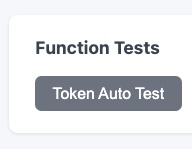
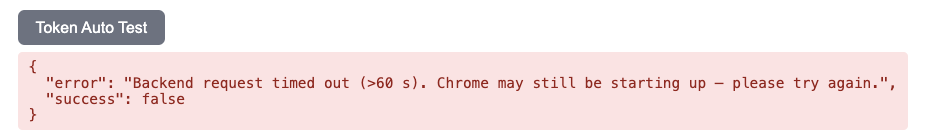
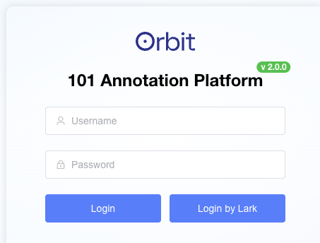
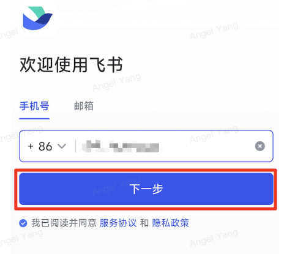
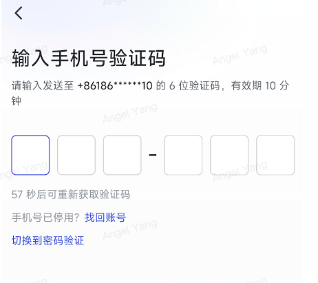
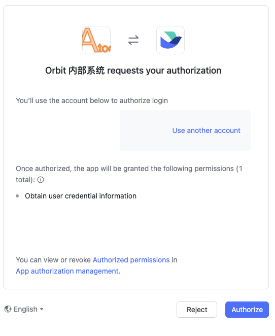
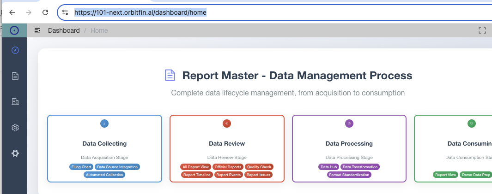
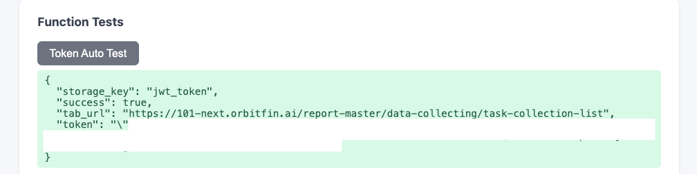

# 用户使用说明
一站式自动收集数据说明

## 如何取得api调用时需要的access token

前提条件是在飞书中OrbitFin这个公司已经对你的手机号码进行了授权

### 第一次使用飞书进行授权

点击get access token button

**注意：第一次使用的时间比较长，看到超时的提示信息不必在意的**

这个时候会新打开一个Chrome实例，不要关闭它。等页面加载完成之后，点击login by Lark button

可以选择使用手机验证码，也可以选择扫描二维码。我们使用手机验证码

收入手机收到的验证码

点击Authorize button

授权完成之后，就会看到`https://101-next.orbitfin.ai/dashboard/home`首页

最后再次点击get access token button

### 飞书已经授权了的情况

点击get access token button

这个时候会新打开一个Chrome实例，不要关闭它。等页面加载完成之后，点击login by Lark button

点击Authorize button

授权完成之后，就会看到`https://101-next.orbitfin.ai/dashboard/home`首页

最后再次点击get access token button

